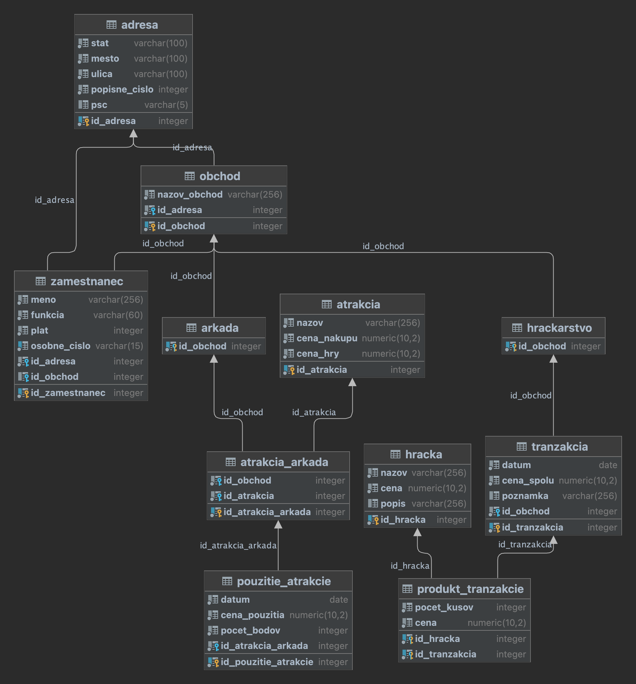
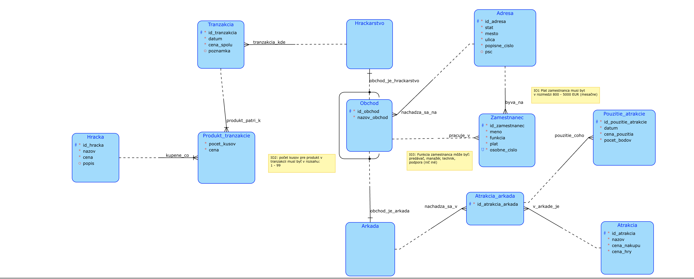
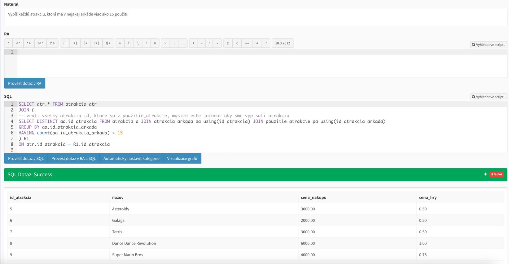

# SQL database of toys and arcades

This database contains 11 tables for storing the transactions of a chain of shops that
work with arcades and toys 
\
We store:
* Shops
* Employees
* Addresses
* Toys
* Transactions
* Arcade machines
* Usages of arcade machines

## SQL scripts
This project contains 3 scripts:
* create_databases.sql: will generate the structure of all tables
* populate_databases.sql: will populate the databases with data
* queries.sql: number of possible queries on these database to get various results. Used for training
of many SQL commands

## Diagrams
This project contains 2 diagrams:
* conceptual_scheme.png: a diagram to easily visualize the connections between the tables
* relational_scheme.png: a diagram explaining various types of columns in tables and their relationships, automatically 
generated

## Queries
This project also contains multiple queries for SQL training in the `queries.sql`

